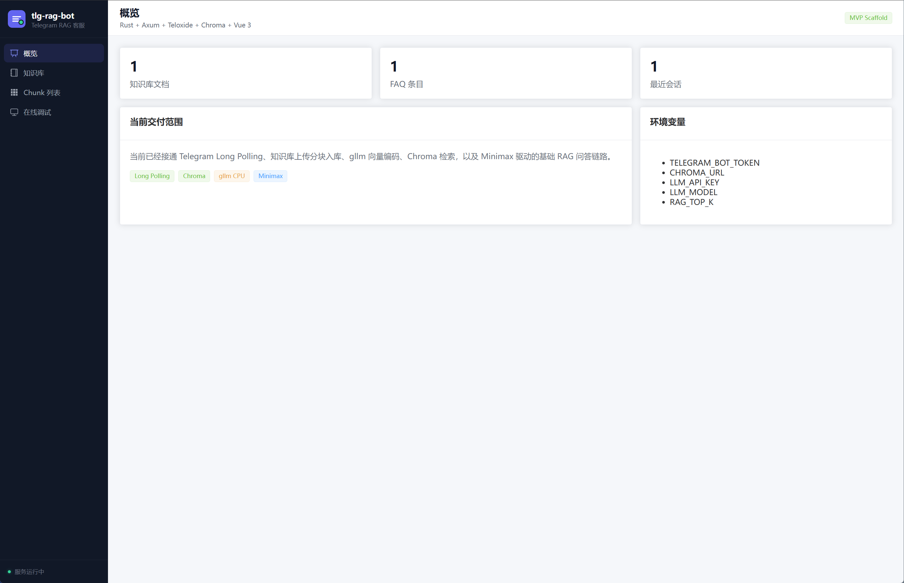
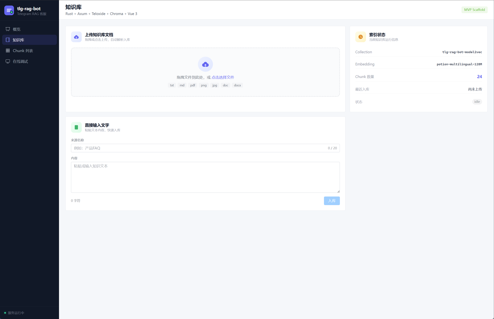
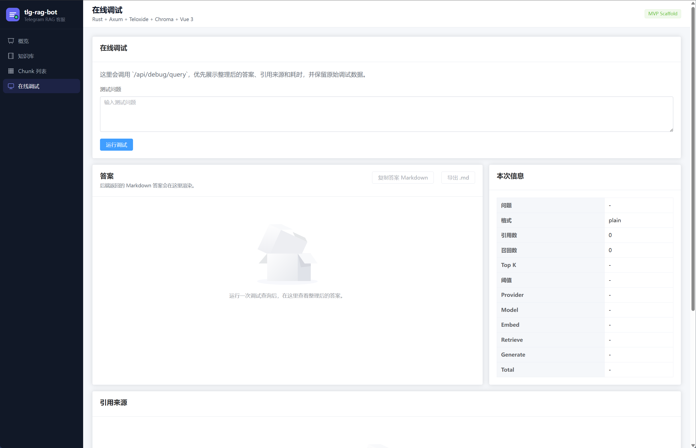
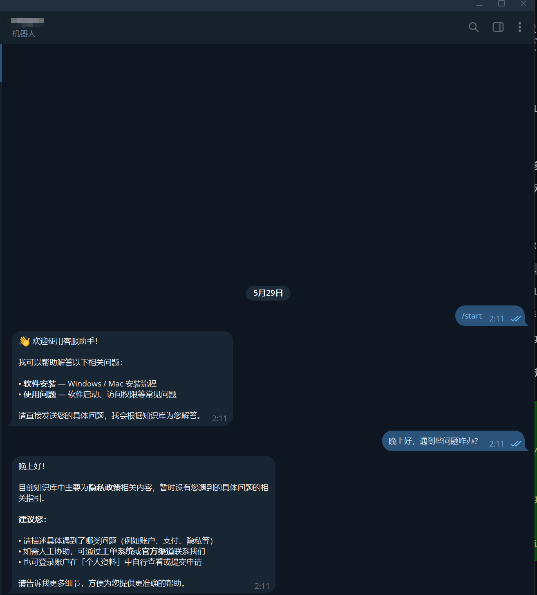

# tlg-rag-bot

Telegram 自动问答客服机器人。基于 RAG（检索增强生成）架构，支持知识库上传、Telegram 直接问答、前端可视化管理和在线调试。

## 页面预览

### 概览页面



### 知识库页面



### 在线调试页面



### Telegram Bot 问答示例



## 功能特性

- **Telegram 问答** — Bot 接收消息，自动检索知识库并生成回答
- **知识库管理** — 前端上传文档，支持 txt / md / pdf / png / jpg / doc / docx，自动分块入库
- **PDF/图片 OCR** — 扫描版 PDF、图片、Word 文档通过 MiMo Vision 模型识别文字
- **在线调试** — 前端页面实时测试 RAG 链路，查看召回片段和生成结果
- **批量管理** — Chunk 列表支持按来源筛选和批量删除
- **可切换 AI 模型** — OCR 模型和问答模型均可通过环境变量切换

## 技术栈

| 层级 | 技术 |
|---|---|
| Bot | Rust + teloxide |
| Backend | Rust + axum |
| Frontend | Vue 3 + Vite + Element Plus |
| Vector DB | Chroma |
| Embedding | `model2vec-rs` (本地 CPU，`minishlab/potion-multilingual-128M`) |
| LLM | Minimax (Anthropic-compatible Messages API) |
| OCR | MiMo Vision (Anthropic-compatible API) |

## 项目结构

```
tlg-rag-bot/
├── .env.example          # 环境变量配置模板
├── README.md
├── docs/
│   └── overview.md       # 项目大纲
├── backend/              # Rust 后端
│   ├── Cargo.toml
│   └── src/
│       ├── main.rs       # 入口，启动 HTTP 服务和 Telegram Long Polling
│       ├── app.rs        # axum 路由定义
│       ├── config.rs     # 环境变量解析
│       ├── state.rs      # AppState 依赖注入
│       ├── routes/       # HTTP 接口
│       ├── services/    # RAG、OCR、Embedding、LLM、Chroma 服务
│       └── models/       # 数据结构
└── frontend/             # Vue 3 前端
    ├── package.json
    ├── vite.config.ts    # Vite 配置，含 /api 代理到后端
    └── src/
        ├── api/bot.ts    # 调用后端 API
        ├── views/        # 页面组件
        └── App.vue       # 路由入口
```

## 环境要求

- **Rust** (stable) + Cargo
- **Node.js** 20+ / **npm** 10+
- **Chroma** (向量数据库)
- **Telegram Bot Token** (仅 Telegram 模式需要)
- **Minimax API Key** (问答模型)
- **MiMo API Key** (PDF/图片 OCR，可选)

## 环境变量配置

```bash
# 复制配置模板
cp .env.example .env
```

完整配置项说明：

```bash
# ===== 服务基础 =====
APP_HOST=127.0.0.1          # 后端监听地址
APP_PORT=4000                # 后端监听端口

# ===== Telegram Bot =====
TELEGRAM_ENABLED=true        # 开启 Telegram Long Polling
TELEGRAM_BOT_TOKEN=xxx       # Telegram Bot Token (TELEGRAM_ENABLED=true 时必填)

# ===== Chroma 向量库 =====
CHROMA_URL=http://127.0.0.1:8600
CHROMA_COLLECTION=tlg-rag-bot-model2vec  # 切换 embedding 模型时需新建 collection

# ===== 知识库分块与 Embedding =====
KB_EMBEDDING_MODEL=minishlab/potion-multilingual-128M  # HuggingFace 模型 ID
KB_CHUNK_SIZE=500            # 每个 chunk 的字符数
KB_CHUNK_OVERLAP=100         # 相邻 chunk 重叠字符数
KB_EMBED_BATCH_SIZE=1        # embedding 分批大小
KB_MAX_UPLOAD_BYTES=10485760 # 单文件最大上传大小 (默认 10MB)

# ===== OCR 配置 (PDF/图片/Word 文本识别) =====
# 只需设置 OCR_API_KEY 即可自动启用 OCR
# OCR_ENABLED=true           # 可选，显式启用或禁用
OCR_BASE_URL=https://api.xiaomimimo.com/anthropic
OCR_API_KEY=your-mimo-api-key
OCR_MODEL=mimo-v2.5          # 可切换其他 MiMo Vision 模型
OCR_TIMEOUT_MS=60000
OCR_MAX_TOKENS=4096

# ===== 问答 LLM 配置 =====
LLM_PROVIDER=minimax         # 当前仅支持 minimax
LLM_BASE_URL=https://api.minimaxi.com/anthropic
LLM_API_KEY=your-minimax-api-key
LLM_MODEL=MiniMax-M2.7       # 可切换其他 Anthropic-compatible 模型
LLM_TIMEOUT_MS=30000
LLM_MAX_TOKENS=512
LLM_TEMPERATURE=0.2

# ===== RAG 参数 =====
RAG_TOP_K=4                  # 检索返回的 top-k 结果数
# RAG_SCORE_THRESHOLD=0.3    # 可选，召回相似度阈值 (0~1)
RAG_MAX_CONTEXT_CHARS=4000   # 拼入 prompt 的最大字符数
```

## 本地运行

### 1. 启动 Chroma 向量数据库

Docker 方式：

```bash
docker run -d --name chroma \
  -p 8600:8000 \
  chromadb/chroma
```

验证：

```bash
curl http://127.0.0.1:8600/api/v2/heartbeat
```

### 2. 配置环境变量

```bash
cp .env.example .env
# 编辑 .env，填入必要的 API Key 和 Token
```

### 3. 启动后端

```bash
cd backend
cargo build --release
./target/release/tlg-rag-bot
```

或开发模式：

```bash
cd backend
cargo run
```

后端监听 `http://127.0.0.1:4000`。

健康检查：

```bash
curl http://127.0.0.1:4000/api/health
# {"status":"ok","service":"tlg-rag-bot-backend"}
```

### 4. 启动前端开发服务器

```bash
cd frontend
npm install
npm run dev
```

前端访问 `http://127.0.0.1:5173`，Vite 会把 `/api` 请求代理到后端 `http://127.0.0.1:4000`。

### 5. 前端生产构建

```bash
cd frontend
npm run build
```

构建产物在 `frontend/dist/`，可部署到任意静态服务器。

## Linux 部署

### 方式一：直接运行

```bash
# 安装 Rust (如未安装)
curl --proto '=https' --tlsv1.2 -sSf https://sh.rustup.rs | sh

# 编译
cd backend
cargo build --release
mv target/release/tlg-rag-bot /opt/tlg-rag-bot/

# 配置环境变量
cp .env.example /opt/.env
# 编辑 /opt/.env

# 使用 systemd 管理
sudo tee /etc/systemd/system/tlg-rag-bot.service > /dev/null <<EOF
[Unit]
Description=tlg-rag-bot Backend
After=network.target

[Service]
EnvironmentFile=/opt/.env
ExecStart=/opt/tlg-rag-bot
Restart=always

[Install]
WantedBy=multi-user.target
EOF

sudo systemctl daemon-reload
sudo systemctl enable tlg-rag-bot
sudo systemctl start tlg-rag-bot
```

前端使用 nginx 部署静态文件：

```nginx
server {
    listen 80;
    server_name your-domain.com;

    location / {
        root /path/to/frontend/dist;
        try_files $uri $uri/ /index.html;
    }

    location /api/ {
        proxy_pass http://127.0.0.1:4000;
    }
}
```

### 方式二：Docker 部署

构建并启动：

```bash
# 构建镜像
bash scripts/build-docker.sh

# 启动所有服务
docker-compose up -d
```

相关文件：

- `docker-compose.yml` — 一键启动后端 + 前端 + Chroma
- `backend/Dockerfile` — 后端镜像构建
- `Dockerfile.frontend` — 前端镜像构建
- `nginx.conf` — 前端 nginx 配置

停止服务：

```bash
docker-compose down
```
COPY --from=builder /app/tlg-rag-bot /usr/local/bin/
WORKDIR /app
COPY .env.example .env
CMD ["tlg-rag-bot"]
```

根目录 `nginx.conf`：

```nginx
server {
    listen 80;
    server_name _;

    location / {
        root /usr/share/nginx/html;
        try_files $uri $uri/ /index.html;
    }

    location /api/ {
        proxy_pass http://backend:4000;
        proxy_set_header Host $host;
        proxy_set_header X-Real-IP $remote_addr;
    }
}
```

构建并启动：

```bash
# 一键打包（后端 + 前端）
bash scripts/package.sh

# systemd 部署（需 root 权限）
sudo bash scripts/deploy.sh
```

前端使用 nginx 部署静态文件：

## 切换 AI 模型

### 切换 OCR 模型

OCR 用于将 PDF/图片/Word 文档转换为文字。修改环境变量即可切换模型：

```bash
# 使用其他 MiMo Vision 模型
OCR_MODEL=mimo-v2.5

# 或指向其他支持 Anthropic Messages API 的 OCR 服务
OCR_BASE_URL=https://your-custom-ocr-endpoint.com/anthropic
OCR_API_KEY=your-api-key
OCR_MODEL=claude-3-haiku
```

支持的模型取决于 `OCR_BASE_URL` 指向的 API 是否支持 `image` 或 `document` 类型的 media input。

### 切换问答 LLM 模型

问答模型用于根据检索到的知识库片段生成最终回答：

```bash
# 切换到其他 Anthropic-compatible 模型
LLM_BASE_URL=https://api.minimaxi.com/anthropic
LLM_API_KEY=your-api-key
LLM_MODEL=MiniMax-M2.7

# 也可以使用其他兼容 API
LLM_BASE_URL=https://api.anthropic.com
LLM_API_KEY=your-anthropic-key
LLM_MODEL=claude-3-haiku-20240307
```

只要 API 兼容 Anthropic Messages API 格式（`POST /v1/messages`），即可无缝切换。

### 切换 Embedding 模型

修改 `KB_EMBEDDING_MODEL`，**注意需要更换 `CHROMA_COLLECTION` 名称并重新导入知识库**：

```bash
# 使用新的 embedding 模型
KB_EMBEDDING_MODEL=huggingface_model_id_or_local_path
# 必须使用新的 collection，否则向量维度不匹配
CHROMA_COLLECTION=tlg-rag-bot-new-model

# 删除旧 collection（可选）
# 重启后端，重新上传知识库文件
```

## Telegram Bot 配置流程

### 1. 创建 Bot

1. 在 Telegram 搜索 `@BotFather`
2. 发送 `/newbot`
3. 按提示设置 Bot 名称和 username
4. 复制返回的 **Bot Token**

### 2. 配置环境变量

```bash
TELEGRAM_ENABLED=true
TELEGRAM_BOT_TOKEN=123456789:ABCdefGHIjklMNOpqrsTUVwxyz
```

### 3. 验证

启动后端后，直接在 Telegram 给 Bot 发送消息即可。

- 非文本消息会被忽略
- 文本消息走 RAG 链路检索 + 生成
- 知识库不足时返回提示
- 生成失败时返回安全兜底回复

### 4. 不启用 Telegram（仅调试）

```bash
TELEGRAM_ENABLED=false
# 此时不需要 TELEGRAM_BOT_TOKEN
# 后端只启动 HTTP 服务和在线调试接口
```

## 测试验证

### 健康检查

```bash
curl http://127.0.0.1:4000/api/health
```

### RAG 链路测试

```bash
curl -X POST http://127.0.0.1:4000/api/debug/query \
  -H "Content-Type: application/json" \
  -d '{"question":"退款多久到账？"}'
```

成功返回包含：

- `retrieved_chunks` — 召回的文本片段
- `final_answer` — 最终回答
- `provider` / `model` — 当前 LLM 配置
- `timings_ms` — 各阶段耗时

### 前端页面测试

启动前端后访问：

| 页面 | 说明 |
|---|---|
| `/` (Dashboard) | 系统状态概览 |
| `/kb` (KnowledgeBase) | 上传知识库文档 |
| `/chunks` (ChunkList) | 查看/筛选/删除 Chunk |
| `/debug` (DebugView) | 在线调试 RAG 链路 |

### API 完整列表

| 方法 | 路径 | 说明 |
|---|---|---|
| GET | `/api/health` | 健康检查 |
| POST | `/api/kb/upload` | 上传知识库文件 (multipart) |
| POST | `/api/kb/text` | 直接提交文本 |
| GET | `/api/kb/chunks` | 分页获取 Chunk 列表 |
| GET | `/api/kb/chunks?source=xxx` | 按来源筛选 |
| DELETE | `/api/kb/chunks` | 批量删除 (body: `{"ids": [...]}` 或 `{"source": "xxx"}`) |
| GET | `/api/kb/sources` | 获取所有来源列表 |
| POST | `/api/debug/query` | 在线调试 RAG |

### 后端单元测试

```bash
cd backend
cargo test
```

## 常见问题

**Q: 上传 PDF 提示 "requires OCR support"**

A: 需要配置 OCR 环境变量（设置 `OCR_API_KEY` 即可自动启用），或确认 PDF 内确实有可提取的文字（系统会优先尝试本地文本提取，失败后才走 OCR）。

**Q: Telegram Bot 无响应**

A: 确认 `TELEGRAM_ENABLED=true` 且 `TELEGRAM_BOT_TOKEN` 正确。后端日志会打印收到的消息和回复状态。

**Q: 切换 embedding 模型后检索结果异常**

A: 不同 embedding 模型生成的向量维度不同，**必须更换 `CHROMA_COLLECTION` 名称并重新导入知识库**，否则会出现维度不匹配错误。

**Q: 知识库已上传但问答找不到相关内容**

A: 检查 `RAG_TOP_K` 和 `RAG_SCORE_THRESHOLD` 配置。可通过前端 Debug 页面查看实际的召回片段和得分，调整阈值参数。

**Q: 前端 `npm run dev` 无法访问**

A: 确认后端已启动在 `http://127.0.0.1:4000`。Vite dev server 会将 `/api` 请求代理到后端，请确保端口 4000 可用。
